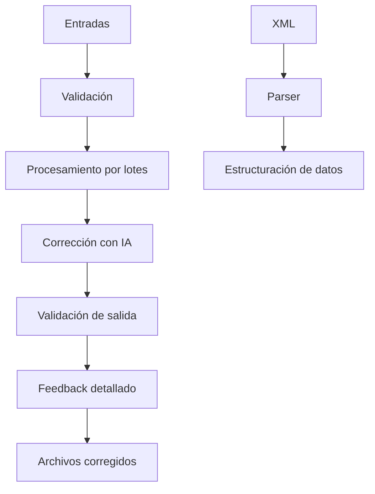

# Tests Automation — Sistema Inteligente de Corrección de Casos de Prueba

[](https://github.com/R0SEWT/tests_automation/actions/workflows/ci.yml)


## Descripción

**Tests Automation** es un sistema diseñado para automatizar y mejorar la documentación de pruebas de software mediante técnicas de inteligencia artificial. Combina procesamiento de lenguaje natural, parsers estructurados y automatización de flujos para optimizar el trabajo de Quality Assurance (QA).

---

## Objetivo y Alcance

### Objetivo principal
Automatizar la corrección ortográfica, gramatical y de estilo en casos de prueba y resultados esperados, manteniendo coherencia técnica y reduciendo la carga de revisión manual.

### Objetivos específicos
- Corrección automática de redacción y estilo en artefactos de QA.  
- Procesamiento con IA (DeepSeek/OpenAI) preservando el contexto técnico.  
- Pipeline automatizado desde entrada hasta salida corregida.  
- Generación de reportes de cambios para trazabilidad.  
- Soporte para extracción de historias de usuario en XML.  

### Problemas que resuelve
- Inconsistencias de redacción en documentación de pruebas.  
- Errores ortográficos y gramaticales.  
- Tiempos elevados de revisión manual.  
- Ausencia de estándares en los resultados esperados.  
- Procesamiento manual de historias de usuario.  

---

## Arquitectura del sistema

```

tests\_automation/
├── src/                       # Código fuente principal
│   ├── redactionAssitant/     # Motor principal de corrección IA
│   │   ├── main.py            # Punto de entrada del sistema
│   │   ├── config.py          # Gestión de configuración centralizada
│   │   ├── processor.py       # Procesamiento por lotes y concurrencia
│   │   ├── builder.py         # Construcción de prompts para IA
│   │   └── utils.py           # Utilidades de I/O y manejo de datos
│   ├── doc\_parser/            # Parser de documentos XML
│   │   └── parser\_hu.py       # Extractor de historias de usuario
│   └── main.py                # Script principal alternativo
├── data/                      # Datos de entrada y salida
│   ├── raw/                   # Archivos sin procesar
│   └── processed/             # Archivos corregidos y feedback
├── notebooks/                 # Jupyter notebooks para análisis
├── utils/                     # Herramientas auxiliares
└── config/                    # Archivos de configuración

````

---

## Componentes principales

### RedactionAssistant (motor IA)
Core del sistema, basado en LLMs para corrección y normalización de texto.  
Incluye módulos de procesamiento concurrente, construcción de prompts y validación de integridad.

### Doc Parser (procesador XML)
Parser que extrae historias de usuario desde XML y las convierte en estructuras procesables (JSON/CSV).

### Testing Tools
Scripts auxiliares para validación manual y pruebas web.

### Notebooks
Prototipado, análisis y monitoreo de métricas.

---

## Tecnologías utilizadas

**Backend e IA**
- Python 3.8+
- DeepSeek/OpenAI API (cliente [`openai`](https://pypi.org/project/openai/))
- BeautifulSoup4 + lxml (parsing XML)
- pandas + xmltodict (procesamiento y normalización de datos)
- concurrent.futures (procesamiento concurrente)

**Testing**  
- Pytest + pytest-cov + pytest-mock  
- GitHub Actions (CI/CD)  
- AutoHotkey (testing manual en Windows)  

**Gestión de datos**  
- pathlib (manejo de rutas)  
- python-dotenv (variables de entorno)  
- logging (trazabilidad de procesos)  

---

## Instalación y configuración

### Dependencias

Las dependencias del proyecto se gestionan en `requirements.txt` con rangos
semánticos para asegurar compatibilidad sin quedar atados a builds locales. Las
bibliotecas utilizadas activamente en el código son:

- `beautifulsoup4` y `lxml` para parsear XML.
- `openai` como cliente para DeepSeek/OpenAI.
- `pandas` para normalización tabular de las HU.
- `python-dotenv` para la carga de variables de entorno.
- `xmltodict` para convertir estructuras XML a diccionarios.
- `pytest`, `pytest-cov` y `pytest-mock` para la suite de pruebas.

### Requisitos previos
- Python 3.10 o superior
- API Key válida (DeepSeek u OpenAI)

### Pasos
```bash
# 1. Clonar el repositorio
git clone https://github.com/R0SEWT/tests_automation.git
cd tests_automation

# 2. Crear entorno virtual
python -m venv .venv
source .venv/bin/activate  # Linux/Mac
# .venv\Scripts\activate   # Windows

# 3. Instalar dependencias
pip install -r requirements.txt

# 4. Verificar la instalación de dependencias
pip check

# 5. Configurar variables de entorno
cp .env.example .env
# Editar .env con tu API key
````

Ejemplo de `.env`:

```ini
DS_API_KEY=tu_api_key
HU_CODE=USRNM
```

> Nota: si `HU_CODE` no está definida en tu entorno, el sistema utilizará `USRNM` como prefijo por defecto. Configura esta variable si necesitas personalizar el código de historia de usuario.

---

## Uso

### Corrección automática de casos de prueba

```bash
# Coloca tus archivos en data/raw/:
# - UserStory.txt
# - TestCases.txt
# - expectedResults.txt

python src/redactionAssitant/main.py
```

Los resultados corregidos se guardan en `data/processed/`.

### Procesamiento de historias de usuario (XML)

```bash
python src/doc_parser/parser_hu.py
```

### Testing manual automatizado (Windows)

Ejecutar el script `manual_testing2.ahk`.

---

## Flujo de procesamiento



---

## Testing y calidad

### Suite de pruebas automatizadas

* Cobertura actual: \~97% en módulos críticos.
* Tests unitarios para Processor, Builder, Config y utilidades.
* Uso de mocks para aislar dependencias externas.
* Ruff para linting y formateo (PEP 8).
* Integración en CI/CD (validación automática en cada push/pull).
* Requisito mínimo: cobertura ≥80% para merge.

### Ejecutar tests

```bash
#pip install pytest pytest-cov pytest-mock ruff

# Linting y estilo
ruff check .

# Tests con cobertura
pytest --cov=src/redactionAssistant --cov-report=term-missing
```

### Estructura de tests

```
tests/
├── test_builder.py
├── test_config.py
├── test_main.py
├── test_processor.py
└── test_utils.py
```

---

## Roadmap

**Versión 2.0**

* Interfaz web con FastAPI/Flask
* Soporte para DOCX/PDF
* Base de datos para historial de correcciones
* API REST para integración externa

**Versión 3.0**

* Aprendizaje automático para mejora continua
* Integración con JIRA/Azure DevOps
* Dashboard de métricas en tiempo real
* Soporte multi-idioma

---

## Licencia

Este proyecto está licenciado bajo los términos de la **Apache License 2.0**.
Ver archivo [LICENSE](./LICENSE).

---

## Contacto

* Reportar problemas vía *Issues*.
* Pull Requests bienvenidos.
* Autor: [linkedin.com/in/r0sewt](https://www.linkedin.com/in/r0sewt) · [rosewt.dev](https://rosewt.dev)

```
