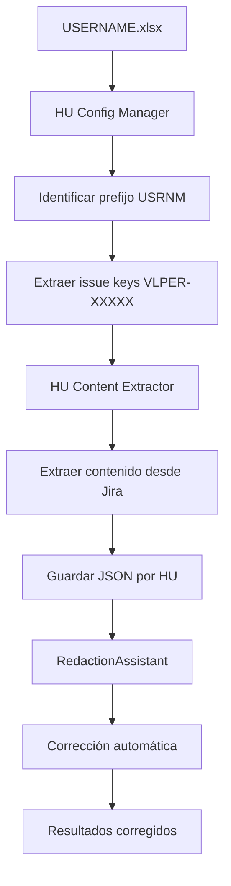
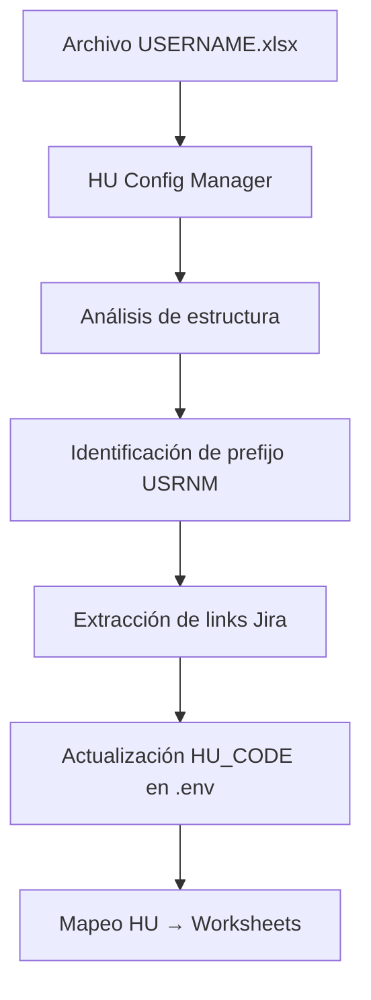
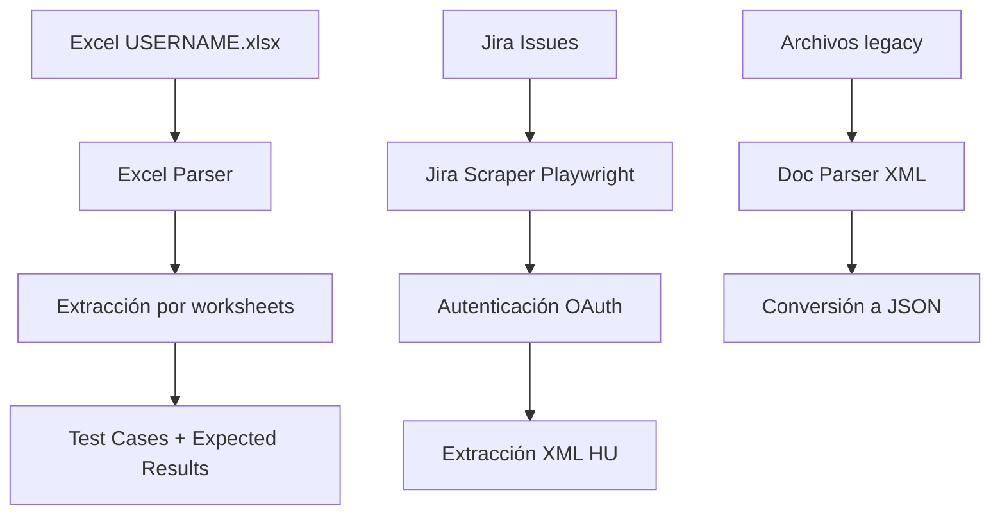
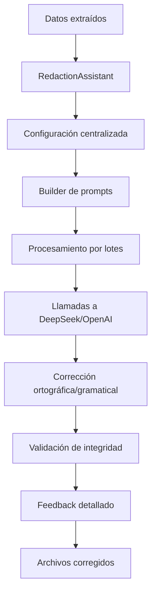
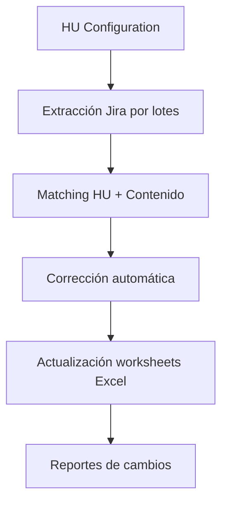

# Tests Automation — Sistema Inteligente de Corrección de Casos de Prueba

## Descripción

**Tests Automation** es un sistema diseñado para automatizar y mejorar la documentación de pruebas de software mediante técnicas de inteligencia artificial. Combina procesamiento de lenguaje natural, parsers estructurados y automatización de flujos para optimizar el trabajo de Quality Assurance (QA).

---

## Objetivo y Alcance

### Objetivo principal
Automatizar la corrección ortográfica, gramatical y de estilo en casos de prueba y resultados esperados, manteniendo coherencia técnica y reduciendo la carga de revisión manual.

### Objetivos específicos
- Corrección automática de redacción y estilo en artefactos de QA.
- Procesamiento con IA (DeepSeek/OpenAI) preservando el contexto técnico.
- Pipeline automatizado desde entrada hasta salida corregida.
- Generación de reportes de cambios para trazabilidad.
- Soporte para extracción de historias de usuario en XML.

### Problemas que resuelve
- Inconsistencias de redacción en documentación de pruebas.
- Errores ortográficos y gramaticales.
- Tiempos elevados de revisión manual.
- Ausencia de estándares en los resultados esperados.
- Procesamiento manual de historias de usuario.

---

## Arquitectura del sistema

```
tests_automation/
├── src/                       # Código fuente principal
│   ├── redactionAssistant/     # Motor principal de corrección IA
│   │   ├── main.py            # Punto de entrada del sistema
│   │   ├── config.py          # Gestión de configuración centralizada
│   │   ├── processor.py       # Procesamiento por lotes y concurrencia
│   │   ├── builder.py         # Construcción de prompts para IA
│   │   └── utils.py           # Utilidades de I/O y manejo de datos
│   ├── doc_parser/            # Parser de documentos XML
│   │   └── parser_hu.py       # Extractor de historias de usuario
│   ├── excel_parser/          # Parser de archivos Excel
│   │   ├── __init__.py        # Inicialización del módulo
│   │   └── excel_extractor.py # Extractor de casos de prueba Excel
│   ├── hu_config_manager.py   # Gestor de configuración HU
│   ├── jira_import/           # Scraper de Jira
│   │   └── jira_scraper.py    # Automatización de extracción de issues
│   └── main.py                # Script principal alternativo
├── data/                      # Datos de entrada y salida
│   ├── raw/                   # Archivos sin procesar
│   └── processed/             # Archivos corregidos y feedback
├── notebooks/                 # Jupyter notebooks para análisis
├── utils/                     # Herramientas auxiliares
├── config/                    # Archivos de configuración
│   ├── jira_config.env.example # Ejemplo de configuración Jira
│   └── jira_config.env        # Configuración Jira (ignorada por git)
└── tests/                     # Suite de pruebas
```

---

## Componentes principales

### RedactionAssistant (motor IA)
Core del sistema, basado en LLMs para corrección y normalización de texto.
Incluye módulos de procesamiento concurrente, construcción de prompts y validación de integridad.

### HU Config Manager (gestor de configuración HU)
Analiza archivos Excel para extraer configuración de HUs, identificar prefijos, mapear worksheets con códigos HU y preparar datos para matching con contenido de Jira.

### HU Content Extractor (extractor de contenido HU)
Extrae contenido de HUs desde Jira usando la configuración del Excel, procesa en lotes y guarda datos estructurados para corrección automática.

### Jira Import (scraper)
Automatización para extraer datos de issues desde Jira usando Playwright y perfiles de Chrome existentes.

### Testing Tools
Scripts auxiliares para validación manual y pruebas web.

### Notebooks
Prototipado, análisis y monitoreo de métricas.

---

## Tecnologías utilizadas

**Backend e IA**
- Python 3.8+
- DeepSeek/OpenAI API (cliente [`openai`](https://pypi.org/project/openai/))
- BeautifulSoup4 + lxml (parsing XML)
- pandas + xmltodict (procesamiento y normalización de datos)
- concurrent.futures (procesamiento concurrente)

**Automatización Web**
- Playwright (automatización de navegadores)
- Selenium (compatibilidad legacy)

**Testing**
- Pytest + pytest-cov + pytest-mock
- GitHub Actions (CI/CD)
- AutoHotkey (testing manual en Windows)

**Gestión de datos**
- pathlib (manejo de rutas)
- python-dotenv (variables de entorno)
- logging (trazabilidad de procesos)

---

## Instalación y configuración

### Dependencias

Las dependencias del proyecto se gestionan en `requirements.txt` con rangos semánticos para asegurar compatibilidad sin quedar atados a builds locales. Las bibliotecas utilizadas activamente en el código son:

- `beautifulsoup4` y `lxml` para parsear XML.
- `openai` como cliente para DeepSeek/OpenAI.
- `pandas` para normalización tabular de las HU.
- `python-dotenv` para la carga de variables de entorno.
- `xmltodict` para convertir estructuras XML a diccionarios.
- `playwright` para automatización web.
- `pytest`, `pytest-cov` y `pytest-mock` para la suite de pruebas.

### Requisitos previos
- Python 3.10 o superior
- API Key válida (DeepSeek u OpenAI)
- Google Chrome instalado (para Jira scraper)

### Pasos de instalación

```bash
# 1. Clonar el repositorio
git clone https://github.com/R0SEWT/tests_automation.git
cd tests_automation

# 2. Crear entorno virtual
python -m venv .venv
source .venv/bin/activate  # Linux/Mac
# .venv\Scripts\activate   # Windows

# 3. Instalar dependencias
pip install -r requirements.txt

# 4. Instalar navegadores para Playwright
playwright install chromium

# 5. Verificar la instalación de dependencias
pip check

# 6. Configurar variables de entorno
cp .env.example .env
# Editar .env con tu API key

# 7. Configurar Jira scraper (opcional)
cp config/jira_config.env.example config/jira_config.env
# Editar config/jira_config.env con la URL de Jira y las claves de issues
```

### Ejemplos de configuración

**Archivo `.env`:**
```ini
DS_API_KEY=tu_api_key
OPENAI_API_KEY=tu_openai_key
PROVIDER=deepseek
BATCH_SIZE=20
HU_CODE=USRNM
```

**Archivo `config/jira_config.env`:**
```ini
JIRA_BASE_URL=https://tu-jira-instance.com
ISSUE_KEYS=VLPER-12345,VLPER-67890
```

> **Nota**: El archivo `config/jira_config.env` contiene información sensible y está excluido del control de versiones. Nunca lo subas al repositorio.

---

## Troubleshooting configuración

### Errores comunes de configuración

**Error: `PROVIDER no configurado. Debe ser 'deepseek' o 'openai'`**
- **Solución**: Agrega `PROVIDER=deepseek` o `PROVIDER=openai` en tu archivo `.env`
- **Ejemplo**: `PROVIDER=deepseek`

**Error: `DS_API_KEY requerida para provider 'deepseek'`**
- **Solución**: Obtén una API key de [DeepSeek](https://platform.deepseek.com/) y configúrala
- **Ejemplo**: `DS_API_KEY=sk-...`

**Error: `OPENAI_API_KEY requerida para provider 'openai'`**
- **Solución**: Obtén una API key de [OpenAI](https://platform.openai.com/) y configúrala
- **Ejemplo**: `OPENAI_API_KEY=sk-proj-...`

**Error: `BATCH_SIZE no configurado. Debe ser un número entero positivo`**
- **Solución**: Agrega `BATCH_SIZE=20` (o cualquier número positivo) en tu `.env`
- **Recomendación**: Valores típicos: 10-50 dependiendo de tu API rate limits

**Error: `HU_CODE inválido: ''. Debe ser una cadena no vacía`**
- **Solución**: Configura un código válido como `HU_CODE=USRNM`
- **Nota**: Si no configuras HU_CODE, se usa `USRNM` por defecto

### Verificación de configuración

Para verificar que tu configuración es correcta, ejecuta:

```bash
python -c "from src.redactionAssistant.config import Config; cfg = Config(); print('Configuración válida')"
```

Si hay errores, se mostrarán mensajes claros con instrucciones para corregirlos.

---

## Uso

### Corrección automática de casos de prueba

```bash
# Coloca tus archivos en data/raw/:
# - UserStory.txt
# - TestCases.txt
# - expectedResults.txt

python src/redactionAssistant/main.py
```

Los resultados corregidos se guardan en `data/processed/`.

### Procesamiento de historias de usuario (XML)

```bash
python src/doc_parser/parser_hu.py
```

### Extracción de casos de prueba desde Excel

```bash
# Usando el módulo directamente
python -c "
from src.excel_parser.excel_extractor import extract_from_excel_file
result = extract_from_excel_file('path/to/test_cases.xlsx')
print(f'Results saved to: {result}')
"

# O usando el script de demo
python demo_excel_extractor.py
```

Los casos de prueba extraídos se guardan en `data/processed/` como archivos JSON organizados por worksheet.

### Análisis de configuración HU

```bash
# Analizar archivo USERNAME.xlsx y actualizar HU_CODE automáticamente
python analyze_hu_config.py

# Usar el HU Configuration Manager programáticamente
python -c "
from src.hu_config_manager import HUConfigurationManager
manager = HUConfigurationManager('data/USERNAME.xlsx')
print(f'Prefijo HU: {manager.get_hu_prefix()}')
print(f'Códigos HU disponibles: {len(manager.get_available_hu_codes())}')
"
```

### Extracción de contenido HU desde Jira

```bash
# Extraer contenido real de todas las HUs configuradas
python extract_hu_content.py

# Simular extracción para testing (sin navegador)
python simulate_hu_extraction.py
```

Los contenidos extraídos se guardan en `data/raw/hus/` como archivos JSON nombrados por código HU (USRNM01.json, USRNM02.json, etc.).

### Flujo completo de procesamiento HU


```mermaid
graph TD
    A[USERNAME.xlsx] --> B[HU Config Manager]
    B --> C[Identificar prefijo USRNM]
    C --> D[Extraer issue keys VLPER-XXXXX]
    D --> E[HU Content Extractor]
    E --> F[Extraer contenido desde Jira]
    F --> G[Guardar JSON por HU]
    G --> H[RedactionAssistant]
    H --> I[Corrección automática]
    I --> J[Resultados corregidos]
```

1. **Configuración**: `analyze_hu_config.py` analiza USERNAME.xlsx
2. **Extracción**: `extract_hu_content.py` obtiene contenido de Jira
3. **Corrección**: RedactionAssistant procesa y corrige automáticamente
4. **Matching**: Contenido HU se relaciona con worksheets Excel por código

### Extracción de datos desde Jira

```bash
# Asegúrate de tener Chrome ejecutándose con tu sesión de Jira iniciada
python src/main.py
```

Los datos extraídos se guardan en `data/raw/hus/` como archivos JSON.

### Testing manual automatizado (Windows)

Ejecutar el script `manual_testing2.ahk`.

---

## Flujo Actual del Programa

El sistema **Tests Automation** sigue un flujo de procesamiento completo desde la configuración inicial hasta la corrección automática de casos de prueba. A continuación se detalla el flujo completo:

### 🎯 **Fase 1: Configuración y Análisis HU**


```mermaid
graph TD
    A[Archivo USERNAME.xlsx] --> B[HU Config Manager]
    B --> C[Análisis de estructura]
    C --> D[Identificación de prefijo USRNM]
    D --> E[Extracción de links Jira]
    E --> F[Actualización HU_CODE en .env]
    F --> G[Mapeo HU → Worksheets]
```

**Procesos involucrados:**
1. **Análisis del Excel USERNAME.xlsx** con `analyze_hu_config.py`
2. **Identificación automática del prefijo** más común (actualmente "USRNM")
3. **Extracción de 47 links de Jira** desde la hoja "HUs"
4. **Actualización automática de HU_CODE** en el archivo `.env`
5. **Creación de mappings** HU → Worksheets para matching futuro

### 📊 **Fase 2: Extracción de Datos desde Múltiples Fuentes**


```mermaid
graph TD
    A[Excel USERNAME.xlsx] --> B[Excel Parser]
    B --> C[Extracción por worksheets]
    C --> D[Test Cases + Expected Results]

    E[Jira Issues] --> F[Jira Scraper Playwright]
    F --> G[Autenticación OAuth]
    G --> H[Extracción XML HU]

    I[Archivos legacy] --> J[Doc Parser XML]
    J --> K[Conversión a JSON]
```

**Módulos especializados:**
- **Excel Parser**: Extrae casos de prueba organizados por worksheets
- **Jira Scraper**: Automatiza extracción usando Playwright con perfiles persistentes
- **Doc Parser**: Procesa archivos XML legacy de historias de usuario

### 🤖 **Fase 3: Corrección Automática con IA**


```mermaid
graph TD
    A[Datos extraídos] --> B[RedactionAssistant]
    B --> C[Configuración centralizada]
    C --> D[Builder de prompts]
    D --> E[Procesamiento por lotes]
    E --> F[Llamadas a DeepSeek/OpenAI]
    F --> G[Corrección ortográfica/gramatical]
    G --> H[Validación de integridad]
    H --> I[Feedback detallado]
    I --> J[Archivos corregidos]
```

**Componentes del motor IA:**
- **Config**: Gestión centralizada de API keys y parámetros
- **Builder**: Construcción inteligente de prompts según el contexto
- **Processor**: Procesamiento concurrente y manejo de lotes
- **Validación**: Aseguramiento de calidad en correcciones

### 🔄 **Fase 4: Matching HU y Corrección Integrada** *(Próximamente)*


```mermaid
graph TD
    A[HU Configuration] --> B[Extracción Jira por lotes]
    B --> C[Matching HU + Contenido]
    C --> D[Corrección automática]
    D --> E[Actualización worksheets Excel]
    E --> F[Reportes de cambios]
```

**Flujo futuro planificado:**
1. **Extracción masiva** de las 47 HUs desde Jira usando issue keys
2. **Matching automático** entre contenido Jira y worksheets Excel
3. **Aplicación de corrección IA** a casos de prueba por HU
4. **Actualización in-place** de worksheets con contenido corregido

### 📁 **Estructura de Datos y Flujo de Archivos**

```
data/
├── raw/
│   ├── USERNAME.xlsx          # Configuración HU + Test Cases
│   ├── hus/                   # JSON extraídos de Jira
│   │   ├── VLPER-91037.json
│   │   ├── VLPER-91038.json
│   │   └── ...
│   └── [archivos legacy]      # UserStory.txt, TestCases.txt
├── processed/
│   ├── *_test_cases.json      # Casos extraídos del Excel
│   ├── corrected_*.json       # Resultados de corrección IA
│   └── feedback_*.json        # Reportes de cambios
└── config/
    ├── jira_config.env        # URLs y issue keys para Jira
    └── .env                   # API keys y HU_CODE=USRNM
```

### ⚙️ **Configuración Centralizada**

**Archivo `.env`:**
```ini
# IA Configuration
DS_API_KEY=sk-...
OPENAI_API_KEY=sk-proj-...
PROVIDER=deepseek
BATCH_SIZE=20

# HU Configuration (auto-updated)
HU_CODE=USRNM
```

**Archivo `config/jira_config.env`:**
```ini
JIRA_BASE_URL=https://jira.visma.com
ISSUE_KEYS=VLPER-91037,VLPER-91038,...
```

### 🚀 **Ejecución Completa del Sistema**

```bash
# 1. Análisis y configuración HU
python analyze_hu_config.py

# 2. Extracción desde Excel
python -c "from src.excel_parser import ExcelTestExtractor; ext = ExcelTestExtractor('data/USERNAME.xlsx'); ext.extract_and_save()"

# 3. Extracción desde Jira (con Chrome running)
python src/main.py

# 4. Corrección automática
python src/redactionAssistant/main.py
```

### 📈 **Métricas y Monitoreo**

- **47 HUs configuradas** con prefijo "USRNM"
- **55 worksheets** en Excel (47 HU + 8 auxiliares)
- **Cobertura de testing**: ~97% en módulos críticos
- **Procesamiento concurrente** con batch size configurable
- **Validación automática** de integridad en cada paso

---

## Testing y calidad

### Suite de pruebas automatizadas

* Cobertura actual: \~97% en módulos críticos.
* Tests unitarios para Processor, Builder, Config y utilidades.
* Uso de mocks para aislar dependencias externas.
* Integración en CI/CD (validación automática en cada push/pull).
* Requisito mínimo: cobertura ≥80% para merge.

### Ejecutar tests

```bash
pip install pytest pytest-cov pytest-mock

pytest --cov=src/redactionAssistant --cov-report=term-missing
```

### Estructura de tests

```
tests/
├── test_builder.py
├── test_config.py
├── test_main.py
├── test_processor.py
└── test_utils.py
```

---

## Roadmap

- ✅ Ingresa las HUS y expect results desde el excel
- ✅ Análisis automático de configuración HU desde Excel
- ✅ Extracción automática de contenido HU desde Jira
- 🔄 Integración completa con RedactionAssistant para corrección automática
- 🔄 Interfaz web para gestión de correcciones
- 🔄 API REST para procesamiento automatizado
- 🔄 Dashboard de métricas y analytics Extraer lo
---

## Licencia

Este proyecto está licenciado bajo los términos de la **Apache License 2.0**.
Ver archivo [LICENSE](./LICENSE).

---

## Contacto

* Reportar problemas vía *Issues*.
* Pull Requests bienvenidos.
* Autor: [linkedin.com/in/r0sewt](https://www.linkedin.com/in/r0sewt) · [rosewt.dev](https://rosewt.dev)

```
